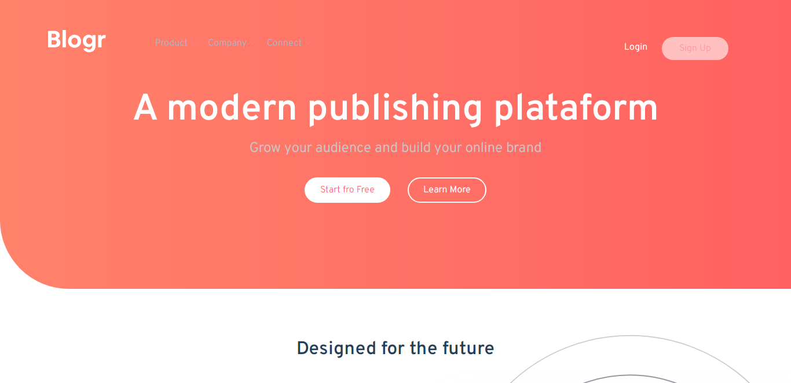

# Frontend Mentor - Blogr landing page solution

This is a solution to the [Blogr landing page challenge on Frontend Mentor](https://www.frontendmentor.io/challenges/blogr-landing-page-EX2RLAApP). Frontend Mentor challenges help you improve your coding skills by building realistic projects. 

## Table of contents

- [Overview](#overview)
  - [The challenge](#the-challenge)
  - [Screenshot](#screenshot)
  - [Links](#links)
- [My process](#my-process)
  - [Built with](#built-with)
- [Author](#author)

## Overview

### The challenge

Users should be able to:

- View the optimal layout for the site depending on their device's screen size
- See hover states for all interactive elements on the page

### Screenshot

### Links

- Solution URL: [Solution](https://www.frontendmentor.io/solutions/responsive-landing-page-blogr-EpXzWdv3dg)
- Live Site URL: [SIte demo](https://dgleyramos1.github.io/blogr)

## My process

### Built with

- Semantic HTML5 markup
- CSS custom properties
- Flexbox
- Mobile-first workflow
- Javascript

## Author

- Website - [Dgley Ramos](https://dgleyramos.pt)
- Frontend Mentor - [@dgleyramos1](https://www.frontendmentor.io/profile/dgleyramos1)
- Twitter - [@dgleyramos](https://twitter.com/dgleyramos)
- Instagram - [@dgleyramos](https://www.instagram.com/dgleyramos/)
- LinkedIn - [@dgleyramos](https://www.linkedin.com/in/dgleyramos/)

